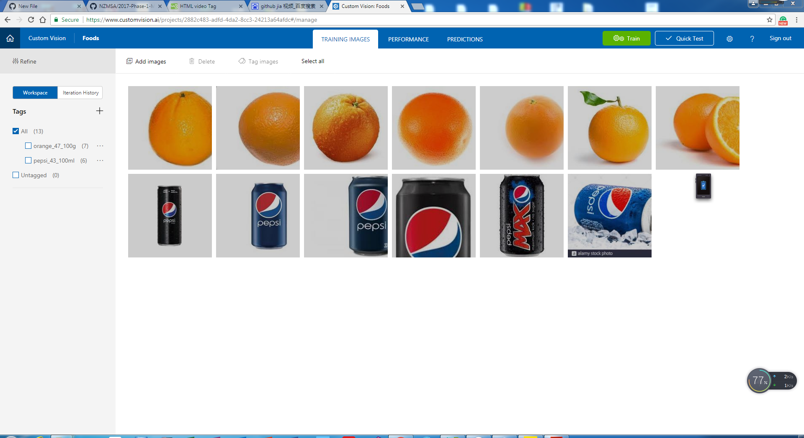
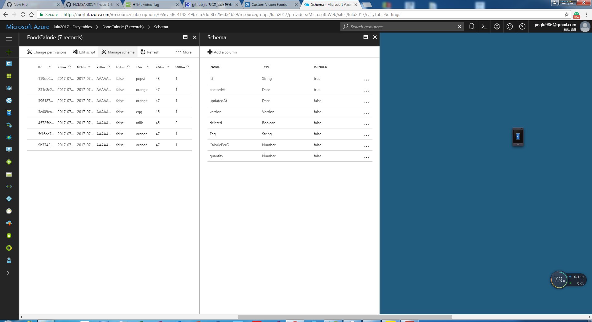

# Xamarin-CrossPlatform-DiaryOfCalorie
Xamarin Apps
<h2>1.Introduction</h2>

I created this project base on the training of New Zealand Micrsoft Student Accelerator<a href="https://github.com/NZMSA/2017-Phase-1-Module-2">(link).</a>
I studied all section,then I built my owner apps.
 
In this project,I did :
                      <ul><li>Created a cross platform mobile app with Xamarin Forms</li>
                           <li>Connected this application with Cognitive Services and build my own Cognitive services</li>
                           <li>Connected this application with Azure and build Eassy Table</li></ul>
<h2>2.Functionlity</h2>
The App can support users to record the daily calor with automatic and manual ways.The users can take a picture of the food, then the 
information of this food will automatic dispaly in the apps and users can save it. Another way, users can manually input the information of the food. I created the video in youtobe to introduce the functionlity of this app.But I just trained two tags in Cognitive services, this app just can recognizes orange and pepsi right now. 
<h4><a href="https://www.youtube.com/watch?v=TSFMPfO6-k0&t=65s">Video Address</a></h4>
<h2> 3.Cognitive Service</h2>
I trained my our module of food. It just includes two tags right now. but it can be update in the future.

<h2>4. Azure </h2>
I created eassy table for records the information of the food.

                      
                      

